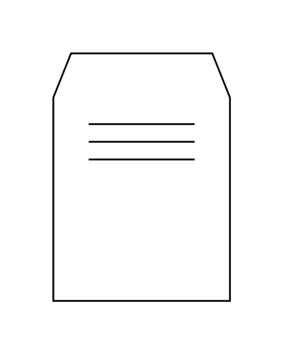

# Drying Oven, Drying Chamber, Shelf Dryer

## Definition

```js
{
  _style: {
    entity: 'shape=mxgraph.pid.driers.drying_oven,_drying_chamber,_shelf_dryer;html=1;pointerEvents=1;align=center;verticalLabelPosition=bottom;verticalAlign=top;dashed=0;',
  },
  _width: 100,
  _height: 140,
}
```

## Usage

```js
import { DryingOvenDryingChamberShelfDryer } from '@dinghy/standard-components-diagrams/procEngDriers'

<DryingOvenDryingChamberShelfDryer/>
```

## Preview


