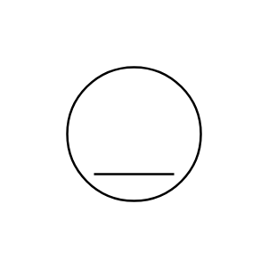

# Electric Motor (DC)

## Definition

```js
{
  _style: {
    entity: 'dashed=0;outlineConnect=0;align=center;html=1;shape=mxgraph.pid.engines.electric_motor_(dc);fontSize=45;',
  },
  _original_width: 100,
  _original_height: 100,

}
```

## Usage

```js
import { ElectricMotorDc } from '@dinghy/standard-components-diagrams/procEngEngines'

<ElectricMotorDc/>
```

## Preview


