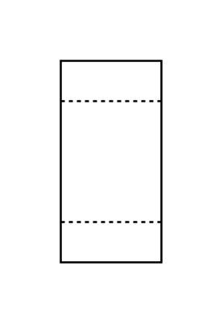

# Proc Eng Filters Entities

- [Filter](./filter.md)  

- [GasFilter](./gas-filter.md)  

- [GasFilterBagCandleCartridge](./gas-filter-bag-candle-cartridge.md)  

- [GasFilterBeltRoll](./gas-filter-belt-roll.md)  

- [GasFilterFixedBed](./gas-filter-fixed-bed.md)  

- [GasFilterHepa](./gas-filter-hepa.md)  

- [LiquidFilter](./liquid-filter.md)  

- [LiquidFilterBagCandleCartridge](./liquid-filter-bag-candle-cartridge.md)  

- [LiquidFilterBeltRoll](./liquid-filter-belt-roll.md)  

- [LiquidFilterBiological](./liquid-filter-biological.md)  

- [LiquidFilterFixedBed](./liquid-filter-fixed-bed.md)  

- [LiquidFilterIonExchanger](./liquid-filter-ion-exchanger.md)  

- [LiquidFilterRotaryDrumOrDiscScraper](./liquid-filter-rotary-drum-or-disc-scraper.md)  

- [LiquidFilterRotaryDrumOrDisc](./liquid-filter-rotary-drum-or-disc.md)  

- [PressFilter](./press-filter.md)  

- [SuctionFilter](./suction-filter.md)  

