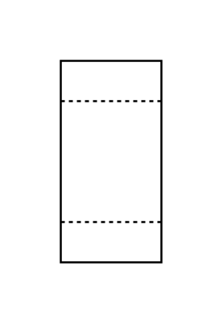

# Liquid Filter (Biological)

## Definition

```js
{
  _style: {
    entity: 'html=1;dashed=0;outlineConnect=0;align=center;shape=mxgraph.pid.filters.liquid_filter_(biological);',
  },
  _width: 50,
  _height: 100,
}
```

## Usage

```js
import { LiquidFilterBiological } from '@dinghy/standard-components-diagrams/procEngFilters'

<LiquidFilterBiological/>
```

## Preview


