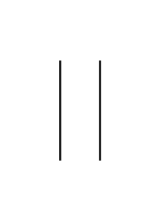

# Flanged Connection

## Definition

```js
{
  _style: {
    entity: 'verticalLabelPosition=bottom;align=center;dashed=0;html=1;verticalAlign=top;shape=mxgraph.pid.fittings.flanged_connection;',
  },
  _width: 20,
  _height: 50,
}
```

## Usage

```js
import { FlangedConnection } from '@dinghy/standard-components-diagrams/procEngFittings'

<FlangedConnection/>
```

## Preview


