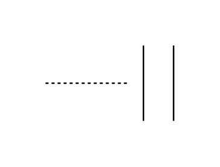

# Flanged Dummy Cover

## Definition

```js
{
  _style: {
    entity: 'verticalLabelPosition=bottom;align=center;dashed=0;html=1;verticalAlign=top;shape=mxgraph.pid.fittings.flanged_dummy_cover;',
  },
  _width: 85,
  _height: 50,
}
```

## Usage

```js
import { FlangedDummyCover } from '@dinghy/standard-components-diagrams/procEngFittings'

<FlangedDummyCover/>
```

## Preview


