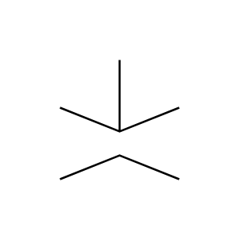

# Flume

## Definition

```js
{
  _style: {
    entity: 'verticalLabelPosition=bottom;align=center;outlineConnect=0;dashed=0;html=1;verticalAlign=top;shape=mxgraph.pid.flow_sensors.flume;pointerEvents=1;',
  },
  _original_width: 50,
  _original_height: 50,

}
```

## Usage

```js
import { Flume } from '@dinghy/standard-components-diagrams/procEngFlowSensors'

<Flume/>
```

## Preview


