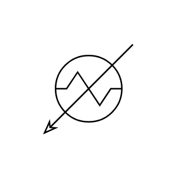

# Heater

## Definition

```js
{
  _style: {
    entity: 'shape=mxgraph.pid.heat_exchangers.heater;html=1;pointerEvents=1;align=center;verticalLabelPosition=bottom;verticalAlign=top;dashed=0;',
  },
  _original_width: 80,
  _original_height: 80,

}
```

## Usage

```js
import { Heater } from '@dinghy/standard-components-diagrams/procEngHeatExchangers'

<Heater/>
```

## Preview


