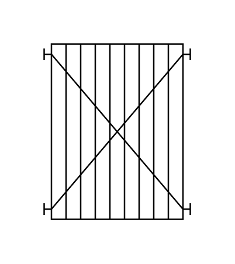

# Plate and Frame Heat Exchanger

## Definition

```js
{
  _style: {
    entity: 'shape=mxgraph.pid.heat_exchangers.plate_and_frame_heat_exchanger;html=1;pointerEvents=1;align=center;verticalLabelPosition=bottom;verticalAlign=top;dashed=0;',
  },
  _width: 100,
  _height: 120,
}
```

## Usage

```js
import { PlateAndFrameHeatExchanger } from '@dinghy/standard-components-diagrams/procEngHeatExchangers'

<PlateAndFrameHeatExchanger/>
```

## Preview


