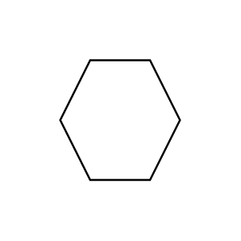
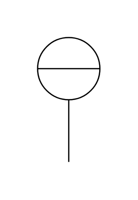
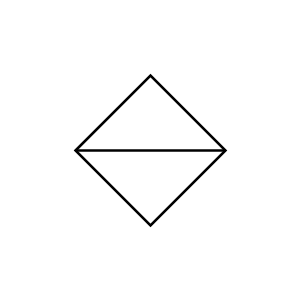

# Proc Eng Instruments Entities

- [ComputerFunctionControlRoom](./computer-function-control-room.md)  

- [ComputerFunctionField](./computer-function-field.md)  

- [ComputerFunctionInaccessible](./computer-function-inaccessible.md)  

- [ComputerFunctionLocalPanel](./computer-function-local-panel.md)  

- [DiscreteInstrumentControlRoom](./discrete-instrument-control-room.md)  

- [DiscreteInstrumentField](./discrete-instrument-field.md)  

- [DiscreteInstrumentInaccessible](./discrete-instrument-inaccessible.md)  

- [DiscreteInstrumentLocalPanel](./discrete-instrument-local-panel.md)  

- [IndicatorControl](./indicator-control.md)  

- [IndicatorFunction](./indicator-function.md)  

- [IndicatorInstrument](./indicator-instrument.md)  

- [IndicatorPlc](./indicator-plc.md)  

- [LogicControlRoom](./logic-control-room.md)  

- [LogicField](./logic-field.md)  

- [LogicInaccessible](./logic-inaccessible.md)  

- [LogicLocalPanel](./logic-local-panel.md)  

- [ProgrammableLogicControlControlRoom](./programmable-logic-control-control-room.md)  

- [ProgrammableLogicControlField](./programmable-logic-control-field.md)  

- [ProgrammableLogicControlInaccessible](./programmable-logic-control-inaccessible.md)  

- [ProgrammableLogicControlLocalPanel](./programmable-logic-control-local-panel.md)  

- [SharedControlDisplayInDcsControlRoom](./shared-control-display-in-dcs-control-room.md)  

- [SharedControlDisplayInDcsField](./shared-control-display-in-dcs-field.md)  

- [SharedControlDisplayInDcsInaccessible](./shared-control-display-in-dcs-inaccessible.md)  

- [SharedControlDisplayInDcsLocalPanel](./shared-control-display-in-dcs-local-panel.md)  

