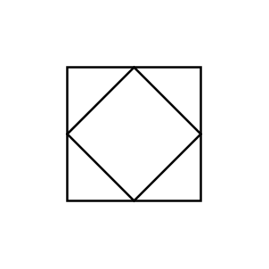

# Programmable Logic Control (field)

## Definition

```js
{
  _style: {
    entity: 'html=1;outlineConnect=0;align=center;dashed=0;aspect=fixed;shape=mxgraph.pid2inst.progLogCont;mounting=field',
  },
  _original_width: 50,
  _original_height: 50,

}
```

## Usage

```js
import { ProgrammableLogicControlField } from '@dinghy/standard-components-diagrams/procEngInstruments'

<ProgrammableLogicControlField/>
```

## Preview


