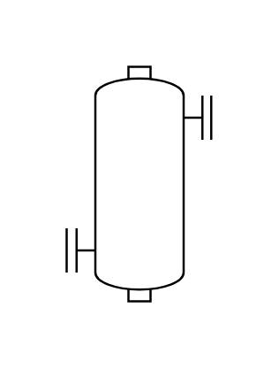

# Air Separator

## Definition

```js
{
  _style: {
    entity: 'verticalLabelPosition=bottom;outlineConnect=0;align=center;dashed=0;html=1;verticalAlign=top;shape=mxgraph.pid.misc.air_separator;',
  },
  _width: 65.5,
  _height: 106,
}
```

## Usage

```js
import { AirSeparator } from '@dinghy/standard-components-diagrams/procEngMisc'

<AirSeparator/>
```

## Preview


