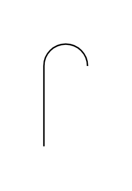

# Curved Gas Vent

## Definition

```js
{
  _style: {
    entity: 'verticalLabelPosition=bottom;outlineConnect=0;align=center;dashed=0;html=1;verticalAlign=top;shape=mxgraph.pid.misc.curved_gas_vent;pointerEvents=1;',
  },
  _width: 30,
  _height: 70,
}
```

## Usage

```js
import { CurvedGasVent } from '@dinghy/standard-components-diagrams/procEngMisc'

<CurvedGasVent/>
```

## Preview


