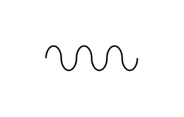

# Flexible Pipe

## Definition

```js
{
  _style: {
    entity: 'verticalLabelPosition=bottom;outlineConnect=0;align=center;dashed=0;html=1;verticalAlign=top;shape=mxgraph.pid.misc.flexible_pipe;pointerEvents=1;',
  },
  _width: 60,
  _height: 16,
}
```

## Usage

```js
import { FlexiblePipe } from '@dinghy/standard-components-diagrams/procEngMisc'

<FlexiblePipe/>
```

## Preview


