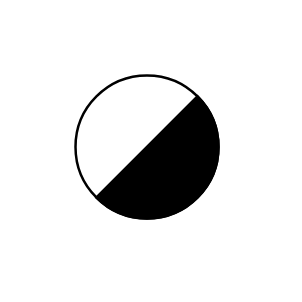

# Steam Trap

## Definition

```js
{
  _style: {
    entity: 'verticalLabelPosition=bottom;outlineConnect=0;align=center;dashed=0;html=1;verticalAlign=top;shape=mxgraph.pid.misc.steam_trap2;',
  },
  _original_width: 53,
  _original_height: 53,

}
```

## Usage

```js
import { SteamTrap } from '@dinghy/standard-components-diagrams/procEngMisc'

<SteamTrap/>
```

## Preview


