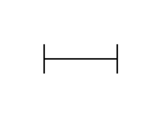

# Removable Spool

## Definition

```js
{
  _style: {
    entity: 'verticalAlign=bottom;pointerEvents=1;dashed=0;shape=mxgraph.pid.piping.removable_spool;html=1;overflow=fill;',
  },
  _width: 50,
  _height: 30,
}
```

## Usage

```js
import { RemovableSpool } from '@dinghy/standard-components-diagrams/procEngPiping'

<RemovableSpool/>
```

## Preview


