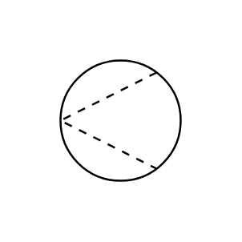

# Temporary Strainer

## Definition

```js
{
  _style: {
    entity: 'verticalLabelPosition=bottom;align=center;dashed=0;html=1;verticalAlign=top;shape=mxgraph.pid.piping.temporary_strainer;',
  },
  _original_width: 30,
  _original_height: 30,

}
```

## Usage

```js
import { TemporaryStrainer } from '@dinghy/standard-components-diagrams/procEngPiping'

<TemporaryStrainer/>
```

## Preview


