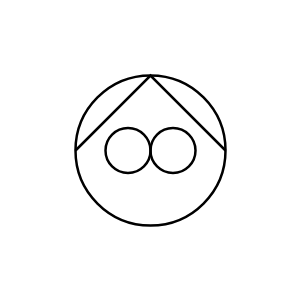

# Gear

## Definition

```js
{
  _style: {
    entity: 'shape=mxgraph.pid.pumps_-_din.gear;html=1;pointerEvents=1;align=center;verticalLabelPosition=bottom;verticalAlign=top;dashed=0;',
  },
  _original_width: 100,
  _original_height: 100,

}
```

## Usage

```js
import { Gear } from '@dinghy/standard-components-diagrams/procEngPumpsDin'

<Gear/>
```

## Preview


