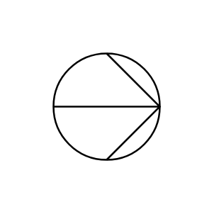

# Pump (Centrifugal)

## Definition

```js
{
  _style: {
    entity: 'shape=mxgraph.pid.pumps_-_iso.pump_(centrifugal);html=1;pointerEvents=1;align=center;verticalLabelPosition=bottom;verticalAlign=top;dashed=0;',
  },
  _original_width: 100,
  _original_height: 100,

}
```

## Usage

```js
import { PumpCentrifugal } from '@dinghy/standard-components-diagrams/procEngPumpsIso'

<PumpCentrifugal/>
```

## Preview


