# Proc Eng Pumps Entities

- [CavityPump](./cavity-pump.md)  
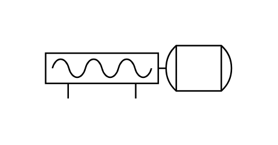

- [CentrifugalPump1](./centrifugal-pump-1.md)  
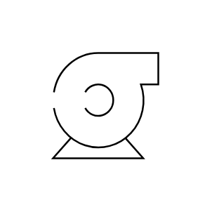

- [CentrifugalPump2](./centrifugal-pump-2.md)  
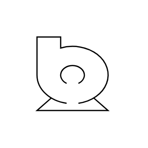

- [CentrifugalPump3](./centrifugal-pump-3.md)  
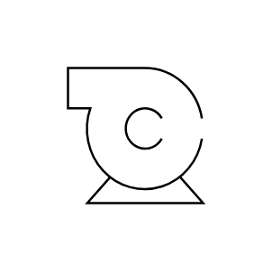

- [FeedPump](./feed-pump.md)  
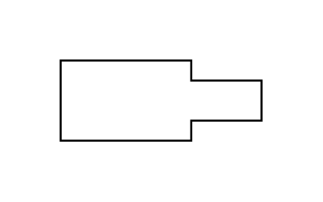

- [GasBlower](./gas-blower.md)  
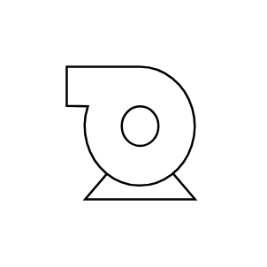

- [GasCompressor](./gas-compressor.md)  
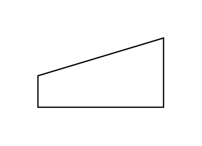

- [GearPump](./gear-pump.md)  
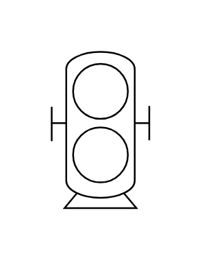

- [HorizontalPump](./horizontal-pump.md)  
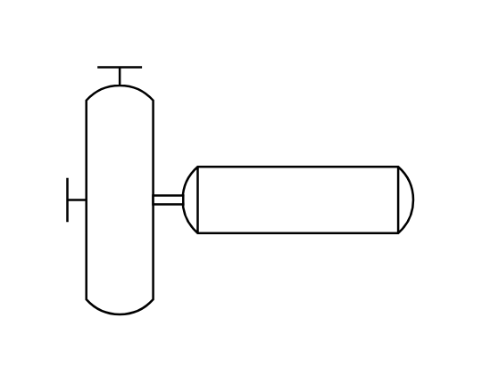

- [Injector](./injector.md)  

- [Peristaltic](./peristaltic.md)  
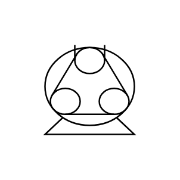

- [ScrewPump](./screw-pump.md)  

- [ScrewPump2](./screw-pump-2.md)  

- [SubmersiblePump](./submersible-pump.md)  
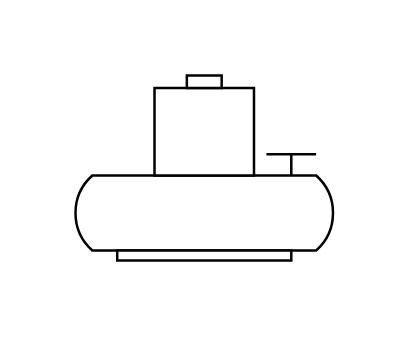

- [SumpPump](./sump-pump.md)  
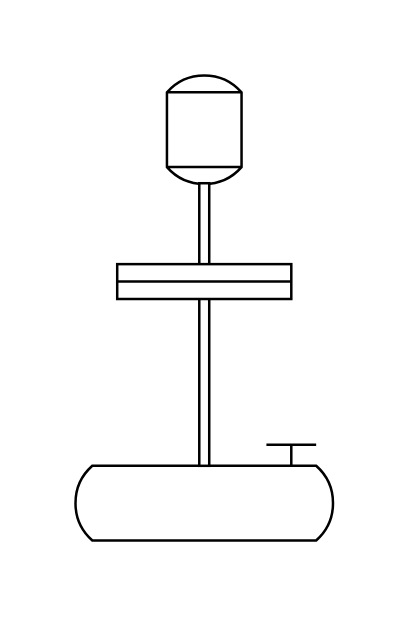

- [Turbine](./turbine.md)  
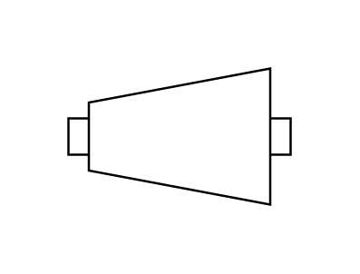

- [VacuumPump](./vacuum-pump.md)  
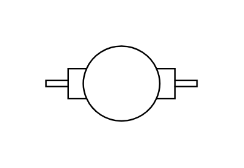

- [VerticalPump](./vertical-pump.md)  
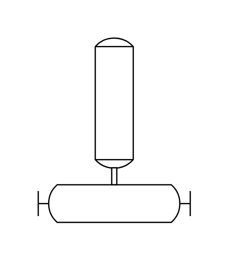
