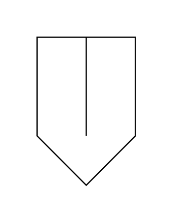

# Impact Separator

## Definition

```js
{
  _style: {
    entity: 'verticalLabelPosition=bottom;align=center;dashed=0;html=1;verticalAlign=top;shape=mxgraph.pid.separators.impact_separator;',
  },
  _width: 80,
  _height: 120,
}
```

## Usage

```js
import { ImpactSeparator } from '@dinghy/standard-components-diagrams/procEngSeparators'

<ImpactSeparator/>
```

## Preview


