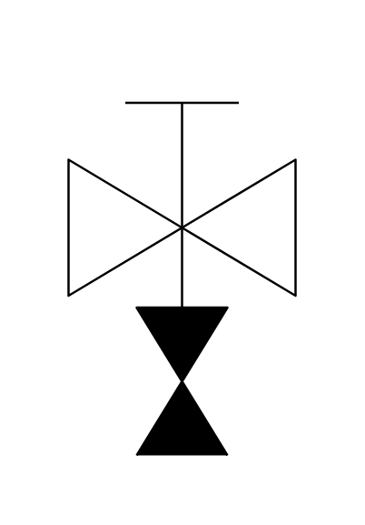

# Integrated Block and Bleed Valve (Manual)

## Definition

```js
{
  _style: {
    entity: 'verticalLabelPosition=bottom;align=center;html=1;verticalAlign=top;pointerEvents=1;dashed=0;shape=mxgraph.pid2valves.blockBleedValve;actuator=man',
  },
  _width: 100,
  _height: 170,
}
```

## Usage

```js
import { IntegratedBlockAndBleedValveManual } from '@dinghy/standard-components-diagrams/procEngValves'

<IntegratedBlockAndBleedValveManual/>
```

## Preview


