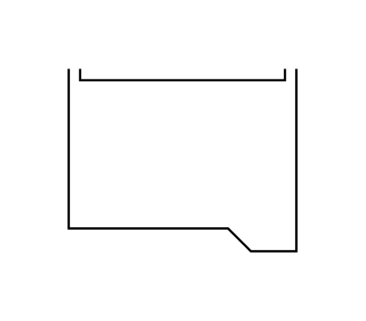

# Tank (Floating Roof, Boot)

## Definition

```js
{
  _style: {
    entity: 'shape=mxgraph.pid.vessels.tank_(floating_roof,_boot);html=1;pointerEvents=1;align=center;verticalLabelPosition=bottom;verticalAlign=top;dashed=0;',
  },
  _width: 100,
  _height: 80,
}
```

## Usage

```js
import { TankFloatingRoofBoot } from '@dinghy/standard-components-diagrams/procEngVessels'

<TankFloatingRoofBoot/>
```

## Preview


