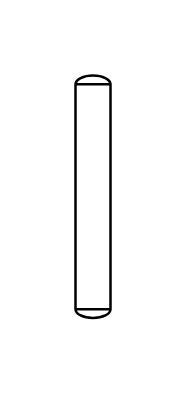

# Tower

## Definition

```js
{
  _style: {
    entity: 'shape=mxgraph.pid.vessels.tower;html=1;pointerEvents=1;align=center;verticalLabelPosition=bottom;verticalAlign=top;dashed=0;',
  },
  _width: 14,
  _height: 97,
}
```

## Usage

```js
import { Tower } from '@dinghy/standard-components-diagrams/procEngVessels'

<Tower/>
```

## Preview


