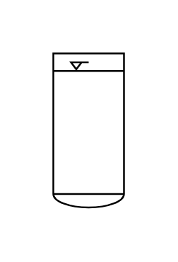

# Vessel (Dished Bottom, Surface Indication)

## Definition

```js
{
  _style: {
    entity: 'shape=mxgraph.pid.vessels.vessel_(dished_bottom,_surface_indication);html=1;pointerEvents=1;align=center;verticalLabelPosition=bottom;verticalAlign=top;dashed=0;',
  },
  _width: 40,
  _height: 87,
}
```

## Usage

```js
import { VesselDishedBottomSurfaceIndication } from '@dinghy/standard-components-diagrams/procEngVessels'

<VesselDishedBottomSurfaceIndication/>
```

## Preview


