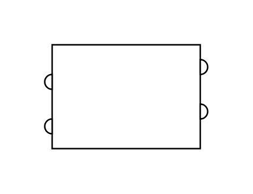

# Vessel (Semi-Tube Heating-Cooling Coil)

## Definition

```js
{
  _style: {
    entity: 'shape=mxgraph.pid.vessels.vessel_(semi-tube_heating-cooling_coil);html=1;pointerEvents=1;align=center;verticalLabelPosition=bottom;verticalAlign=top;dashed=0;',
  },
  _width: 110,
  _height: 70,
}
```

## Usage

```js
import { VesselSemiTubeHeatingCoolingCoil } from '@dinghy/standard-components-diagrams/procEngVessels'

<VesselSemiTubeHeatingCoolingCoil/>
```

## Preview


