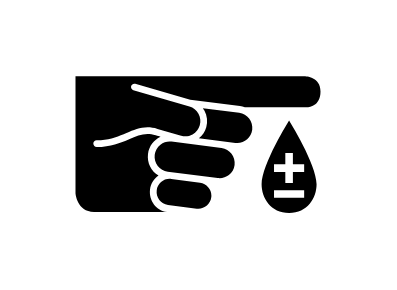
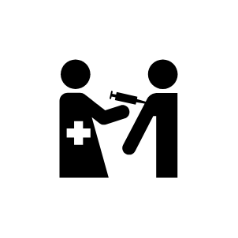
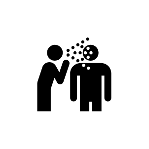
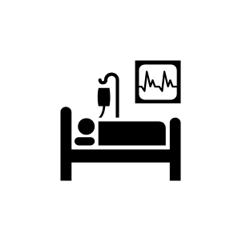
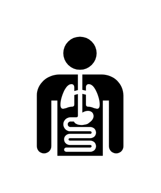
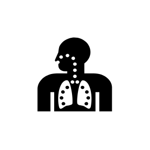
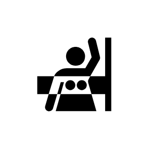
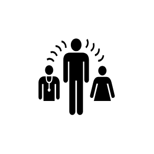
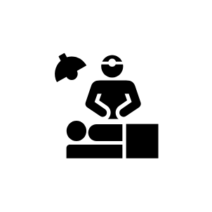
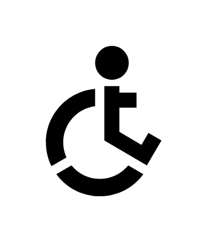

# Signs Healthcare Entities

- [AlternativeMedicine](./alternative-medicine.md)  

- [Anesthesia](./anesthesia.md)  

- [AssistiveListeningSystem](./assistive-listening-system.md)  

- [Brain](./brain.md)  

- [Cardiology](./cardiology.md)  

- [CareStaffArea](./care-staff-area.md)  

- [CathLab](./cath-lab.md)  

- [Chapel](./chapel.md)  

- [Deaf](./deaf.md)  

- [Dermatology](./dermatology.md)  

- [Diabetes](./diabetes.md)  

- [Eye](./eye.md)  

- [EyeWash](./eye-wash.md)  

- [FamilyPractice](./family-practice.md)  

- [FirstAid](./first-aid.md)  

- [Genetics](./genetics.md)  

- [HealthEducation](./health-education.md)  

- [Heart1](./heart-1.md)  

- [Heart2](./heart-2.md)  

- [Hospital1](./hospital-1.md)  

- [Hospital2](./hospital-2.md)  

- [Immunizations](./immunizations.md)  

- [InfectiousDisease](./infectious-disease.md)  

- [Inpatient](./inpatient.md)  

- [IntensiveCare](./intensive-care.md)  

- [InternalMedicine](./internal-medicine.md)  

- [Kidney](./kidney.md)  

- [Lungs](./lungs.md)  

- [Mammogram](./mammogram.md)  

- [MedicalInterpreter](./medical-interpreter.md)  

- [MedicalLibrary](./medical-library.md)  

- [MedicalRecords](./medical-records.md)  

- [MentalHealth](./mental-health.md)  

- [Mri](./mri.md)  

- [Neurology](./neurology.md)  

- [Nutrition](./nutrition.md)  

- [Oncology](./oncology.md)  

- [OutPatient](./out-patient.md)  

- [Pharmacy](./pharmacy.md)  

- [PhysicalTherapy](./physical-therapy.md)  

- [Registration](./registration.md)  

- [SignLanguage](./sign-language.md)  

- [SocialServices](./social-services.md)  

- [Surgery](./surgery.md)  

- [Tdd](./tdd.md)  

- [Tooth](./tooth.md)  

- [Ultrasound](./ultrasound.md)  

- [WheelchairAccessible1](./wheelchair-accessible-1.md)  

- [WheelchairAccessible2](./wheelchair-accessible-2.md)  

- [WheelchairAccessible3](./wheelchair-accessible-3.md)  

