# Signs People Entities

- [Baby1](./baby-1.md)  
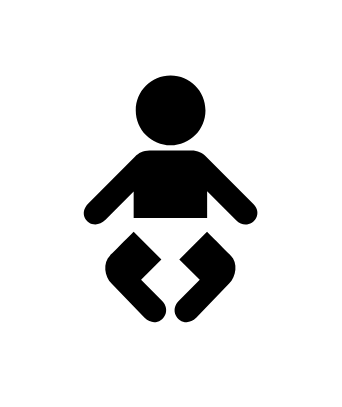

- [Baby2](./baby-2.md)  
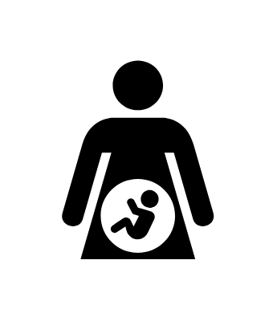

- [ChangingStation](./changing-station.md)  
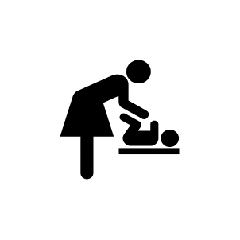

- [Construction](./construction.md)  

- [Female](./female.md)  

- [Male](./male.md)  

- [Man1](./man-1.md)  
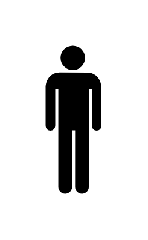

- [Man2](./man-2.md)  
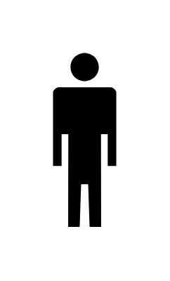

- [Mummy](./mummy.md)  
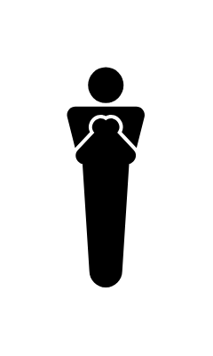

- [Pedestrian](./pedestrian.md)  
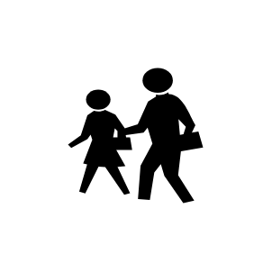

- [Shower1](./shower-1.md)  

- [Shower2](./shower-2.md)  

- [Stroller](./stroller.md)  

- [Unisex](./unisex.md)  
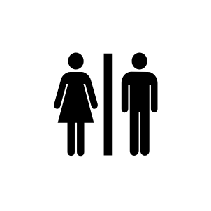

- [WaitingRoom1](./waiting-room-1.md)  
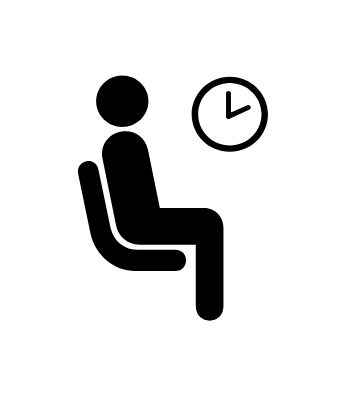

- [WaitingRoom2](./waiting-room-2.md)  
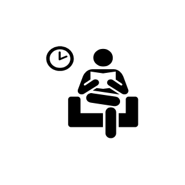

- [Walking](./walking.md)  
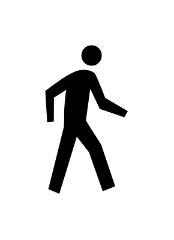

- [Woman1](./woman-1.md)  
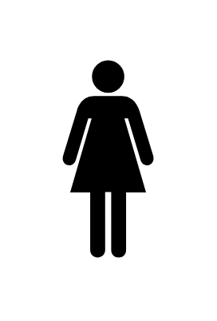

- [Woman2](./woman-2.md)  
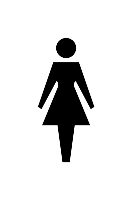
