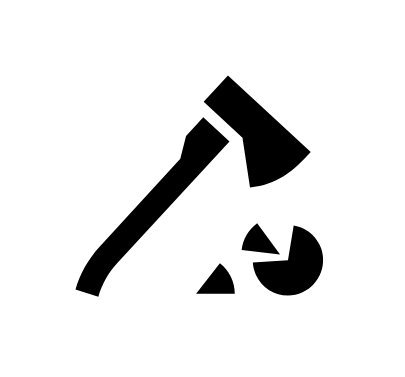

# Firewood

## Definition

```js
{
  _style: {
    entity: 'shape=mxgraph.signs.sports.firewood;html=1;pointerEvents=1;fillColor=#000000;strokeColor=none;verticalLabelPosition=bottom;verticalAlign=top;align=center;sketch=0;',
  },
  _width: 101,
  _height: 90,
}
```

## Usage

```js
import { Firewood } from '@dinghy/standard-components-diagrams/signsSports'

<Firewood/>
```

## Preview


