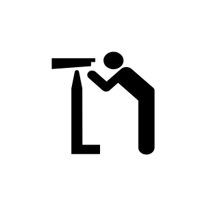

# View

## Definition

```js
{
  _style: {
    entity: 'shape=mxgraph.signs.sports.view;html=1;pointerEvents=1;fillColor=#000000;strokeColor=none;verticalLabelPosition=bottom;verticalAlign=top;align=center;sketch=0;',
  },
  _original_width: 87,
  _original_height: 98,

}
```

## Usage

```js
import { View } from '@dinghy/standard-components-diagrams/signsSports'

<View/>
```

## Preview


