# Signs Transportation Entities

- [Component4Wheeler](./component-4-wheeler.md)  
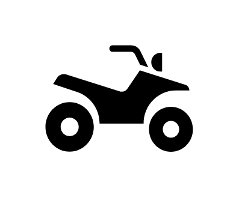

- [Airbag](./airbag.md)  

- [Airplane1](./airplane-1.md)  

- [Airplane2](./airplane-2.md)  
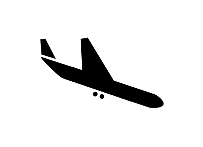

- [Airplane3](./airplane-3.md)  

- [Airplane4](./airplane-4.md)  

- [Airplane5](./airplane-5.md)  

- [Airplane6](./airplane-6.md)  

- [Airplane7](./airplane-7.md)  

- [Ambulance](./ambulance.md)  
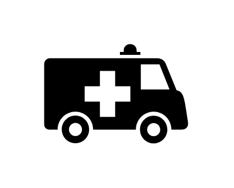

- [Anchor1](./anchor-1.md)  
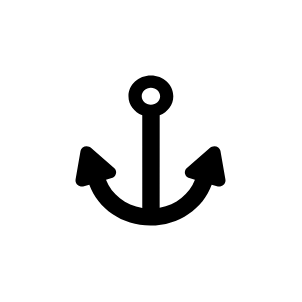

- [Anchor2](./anchor-2.md)  

- [Anchor3](./anchor-3.md)  
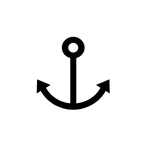

- [Anchor4](./anchor-4.md)  
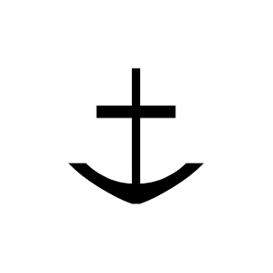

- [Bicycle1](./bicycle-1.md)  
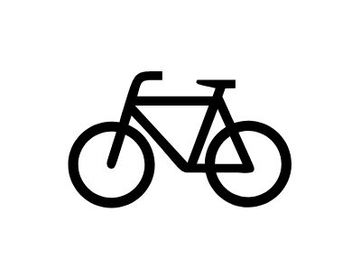

- [Bicycle2](./bicycle-2.md)  
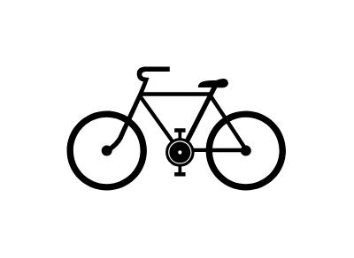

- [Bicycle3](./bicycle-3.md)  
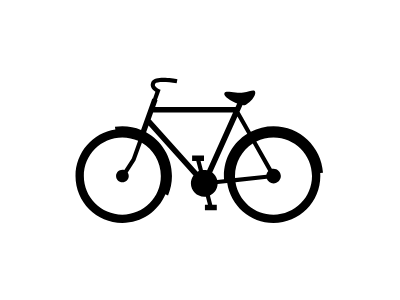

- [Bicycle4](./bicycle-4.md)  
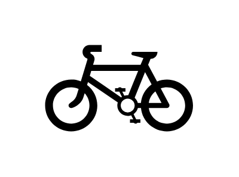

- [Bicycle5](./bicycle-5.md)  
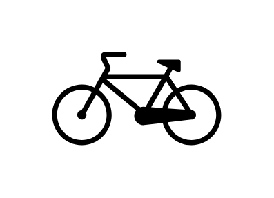

- [Bicycler](./bicycler.md)  

- [Bus1](./bus-1.md)  
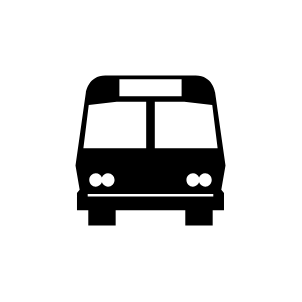

- [Bus2](./bus-2.md)  
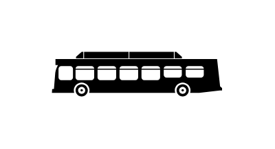

- [Bus3](./bus-3.md)  
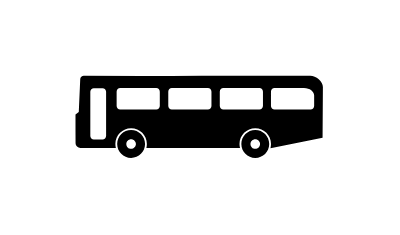

- [Bus4](./bus-4.md)  
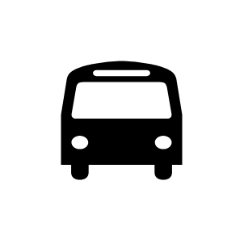

- [Car1](./car-1.md)  
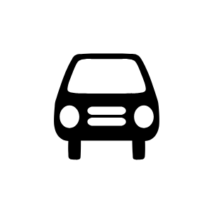

- [Car2](./car-2.md)  

- [Car3](./car-3.md)  
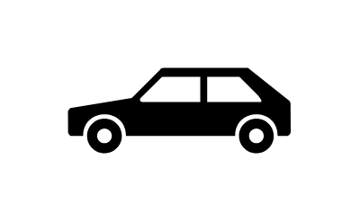

- [Car4](./car-4.md)  
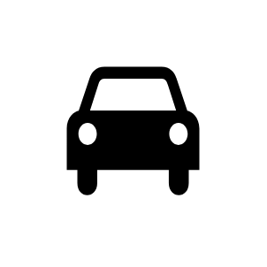

- [CarLock](./car-lock.md)  
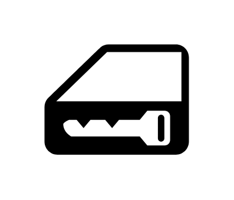

- [DividedHighway](./divided-highway.md)  
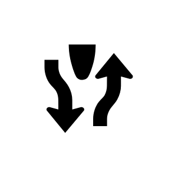

- [Ferry](./ferry.md)  
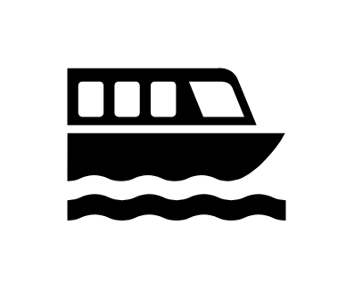

- [Firetruck](./firetruck.md)  
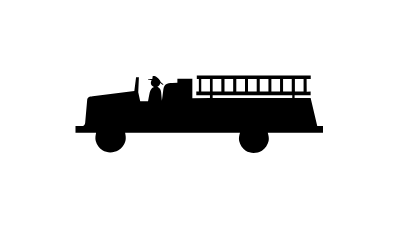

- [Forklift](./forklift.md)  
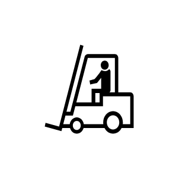

- [Gas1](./gas-1.md)  
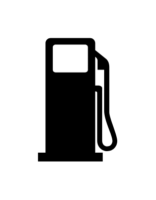

- [Gas2](./gas-2.md)  
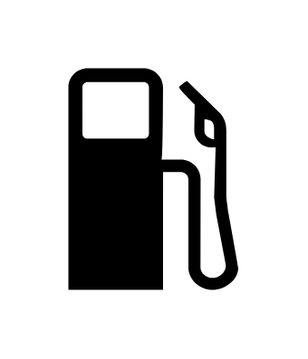

- [Gas3](./gas-3.md)  
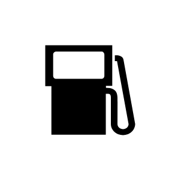

- [Gas4](./gas-4.md)  
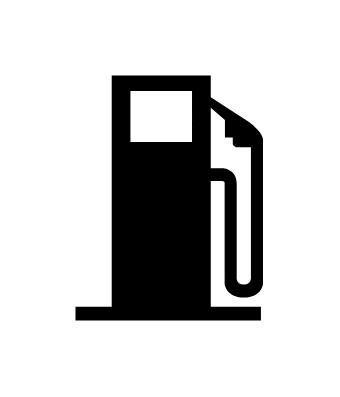

- [GroundTransportation](./ground-transportation.md)  
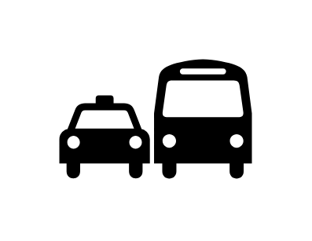

- [Harbor](./harbor.md)  
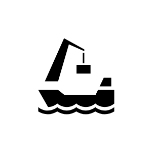

- [Helicopter](./helicopter.md)  
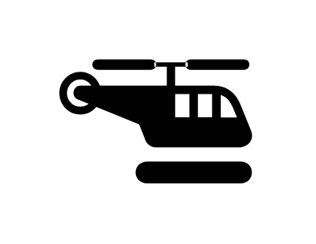

- [Highway](./highway.md)  
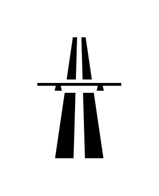

- [Jeep1](./jeep-1.md)  
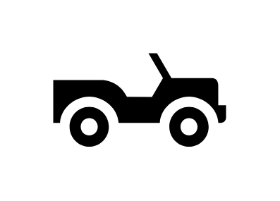

- [Jeep2](./jeep-2.md)  
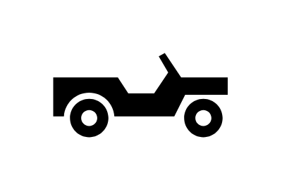

- [Lighthouse1](./lighthouse-1.md)  

- [Lighthouse2](./lighthouse-2.md)  
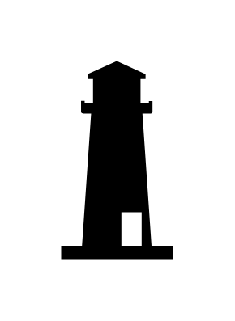

- [Moped1](./moped-1.md)  
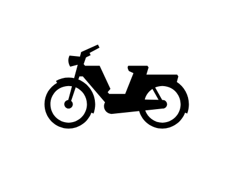

- [Moped2](./moped-2.md)  

- [Motorcycle](./motorcycle.md)  
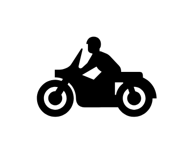

- [PartiallySubmergedWreck](./partially-submerged-wreck.md)  
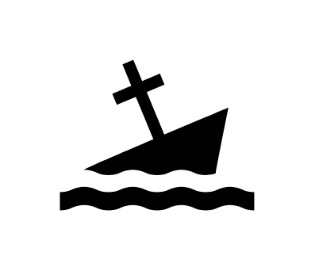

- [RadiatorWater](./radiator-water.md)  
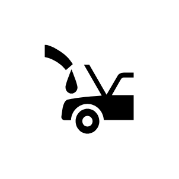

- [Scooter](./scooter.md)  
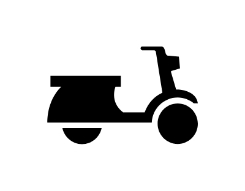

- [SeaPlane](./sea-plane.md)  
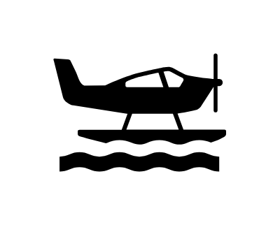

- [SeatBelt](./seat-belt.md)  
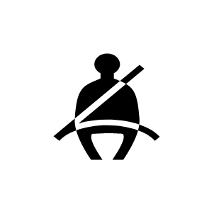

- [Ship1](./ship-1.md)  
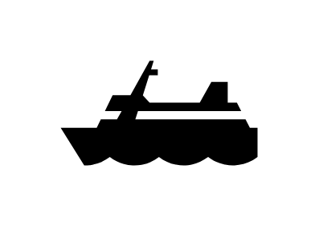

- [Ship2](./ship-2.md)  

- [Tank](./tank.md)  
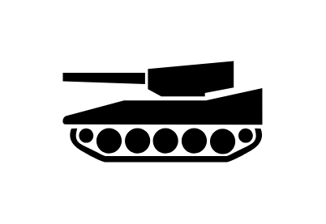

- [Taxi](./taxi.md)  
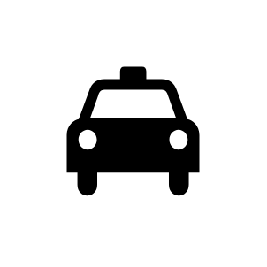

- [TowAway](./tow-away.md)  
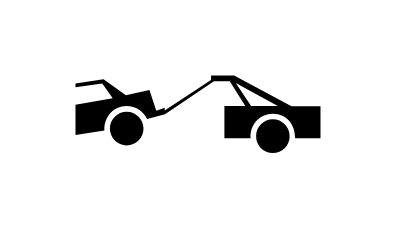

- [Tractor1](./tractor-1.md)  
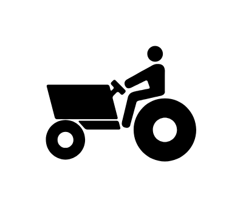

- [Tractor2](./tractor-2.md)  
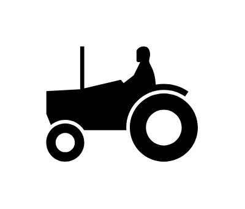

- [Train1](./train-1.md)  
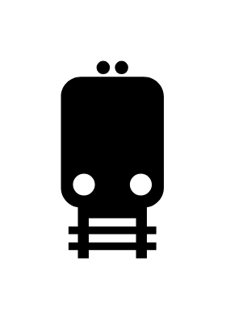

- [Train2](./train-2.md)  
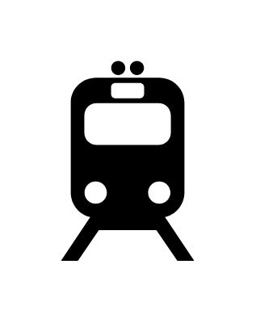

- [Train3](./train-3.md)  
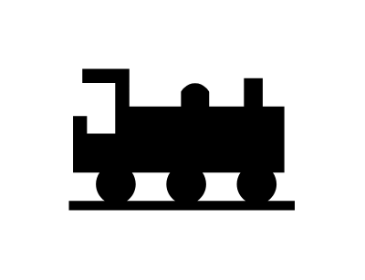

- [TrainStation](./train-station.md)  

- [Tram1](./tram-1.md)  

- [Tram2](./tram-2.md)  

- [Truck1](./truck-1.md)  

- [Truck2](./truck-2.md)  

- [Truck3](./truck-3.md)  

- [Truck4](./truck-4.md)  

- [Truck5](./truck-5.md)  

- [Truck6](./truck-6.md)  

- [Truck7](./truck-7.md)  

- [UnevenRoad](./uneven-road.md)  

- [VehicleFerry](./vehicle-ferry.md)  

