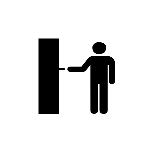

# Ticket Machine

## Definition

```js
{
  _style: {
    entity: 'shape=mxgraph.signs.travel.ticket_machine;html=1;pointerEvents=1;fillColor=#000000;strokeColor=none;verticalLabelPosition=bottom;verticalAlign=top;align=center;sketch=0;',
  },
  _original_width: 88,
  _original_height: 100,

}
```

## Usage

```js
import { TicketMachine } from '@dinghy/standard-components-diagrams/signsTravel'

<TicketMachine/>
```

## Preview


