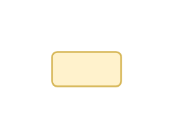

# Asset Label

## Definition

```js
{
  _style: {
    entity: 'text;html=1;strokeColor=#d6b656;fillColor=#fff2cc;align=center;verticalAlign=middle;whiteSpace=wrap;overflow=hidden;',
  },
  _width: 40,
  _height: 20,
}
```

## Usage

```js
import { AssetLabel } from '@dinghy/standard-components-diagrams/threatModeling'

<AssetLabel/>
```

## Preview


