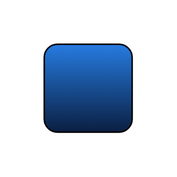

# Mail.ru

## Definition

```js
{
  _style: {
    entity: 'dashed=0;outlineConnect=0;html=1;align=center;labelPosition=center;verticalLabelPosition=bottom;verticalAlign=top;shape=mxgraph.webicons.mail.ru;fillColor=#267BE0;gradientColor=#0A1F42',
  },
  _original_width: 102.4,
  _original_height: 102.4,

}
```

## Usage

```js
import { MailRu } from '@dinghy/standard-components-diagrams/webIcons'

<MailRu/>
```

## Preview


