# Web Logos Entities

- [Adfty](./adfty.md)  

- [AdobePdf](./adobe-pdf.md)  

- [Aim](./aim.md)  

- [Allvoices](./allvoices.md)  

- [Amazon](./amazon.md)  

- [Android](./android.md)  

- [Apache](./apache.md)  

- [AppStore](./app-store.md)  

- [AppStoreIphone](./app-store-iphone.md)  

- [Apple](./apple.md)  

- [AppleClassic](./apple-classic.md)  
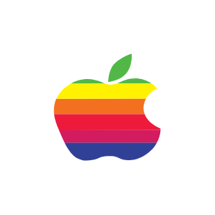

- [Arduino](./arduino.md)  
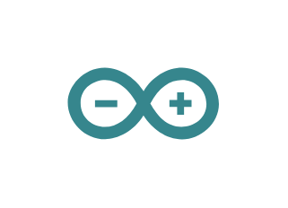

- [Ask](./ask.md)  

- [Atlassian](./atlassian.md)  

- [Audioboo](./audioboo.md)  

- [Aws](./aws.md)  

- [AwsS3](./aws-s3.md)  

- [Baidu](./baidu.md)  

- [Bamboo](./bamboo.md)  

- [Bebo](./bebo.md)  

- [Behance](./behance.md)  
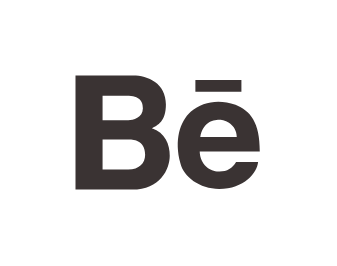

- [Bing](./bing.md)  

- [Bitbucket](./bitbucket.md)  

- [Blinklist](./blinklist.md)  

- [Blogger](./blogger.md)  

- [Blogmarks](./blogmarks.md)  

- [BookmarksFr](./bookmarks-fr.md)  

- [Box](./box.md)  

- [Buddymarks](./buddymarks.md)  

- [Buffer](./buffer.md)  

- [Buzzfeed](./buzzfeed.md)  

- [Chrome](./chrome.md)  

- [Citeulike](./citeulike.md)  

- [Clover](./clover.md)  

- [Confluence](./confluence.md)  

- [Connotea](./connotea.md)  

- [Crowd](./crowd.md)  

- [Crucible](./crucible.md)  

- [Dealsplus](./dealsplus.md)  

- [Designfloat](./designfloat.md)  

- [Deviantart](./deviantart.md)  

- [DiagramsNet](./diagrams-net.md)  

- [DiagramsNet2](./diagrams-net-2.md)  

- [Digg](./digg.md)  

- [Diigo](./diigo.md)  

- [Dopplr](./dopplr.md)  

- [DrawIo](./draw-io.md)  

- [Dribbble](./dribbble.md)  

- [Dropbox2](./dropbox2.md)  

- [Drupal](./drupal.md)  
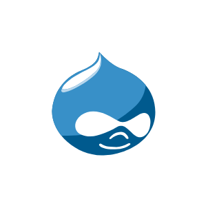

- [Dzone](./dzone.md)  
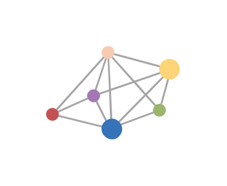

- [Ebay](./ebay.md)  

- [Edmodo](./edmodo.md)  

- [Evernote](./evernote.md)  

- [Fancy](./fancy.md)  
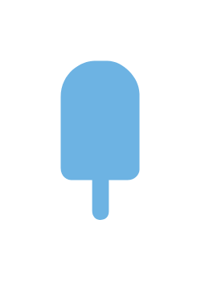

- [Fark](./fark.md)  

- [Fashiolista](./fashiolista.md)  
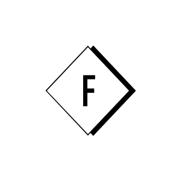

- [Feed](./feed.md)  

- [Feedburner](./feedburner.md)  

- [Fisheye](./fisheye.md)  

- [Flickr](./flickr.md)  
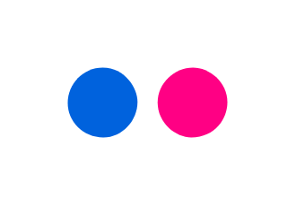

- [Folkd](./folkd.md)  
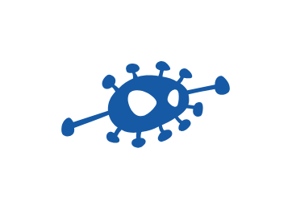

- [Forrst](./forrst.md)  

- [Fotolog](./fotolog.md)  

- [Freshbump](./freshbump.md)  

- [Fresqui](./fresqui.md)  
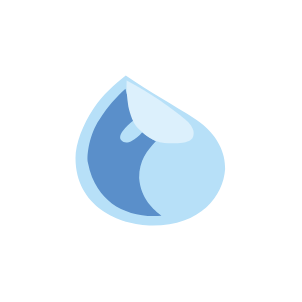

- [Friendfeed](./friendfeed.md)  

- [Funp](./funp.md)  

- [Fwisp](./fwisp.md)  
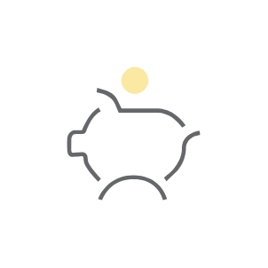

- [Gabbr](./gabbr.md)  

- [Gamespot](./gamespot.md)  

- [Github](./github.md)  
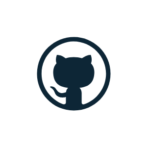

- [Gmail](./gmail.md)  

- [Google](./google.md)  

- [GoogleDrive](./google-drive.md)  

- [GoogleHangout](./google-hangout.md)  

- [GooglePhotos](./google-photos.md)  

- [GooglePlay](./google-play.md)  

- [GooglePlayLight](./google-play-light.md)  

- [Google2](./google-2.md)  

- [Grooveshark](./grooveshark.md)  

- [Hatena](./hatena.md)  
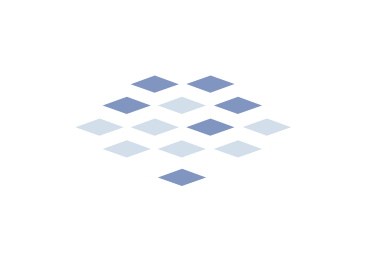

- [Hipchat](./hipchat.md)  

- [Html5](./html5.md)  

- [IdentiCa](./identi-ca.md)  
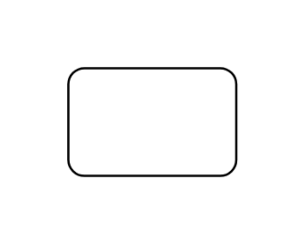

- [Instagram](./instagram.md)  

- [Instapaper](./instapaper.md)  

- [Ios](./ios.md)  

- [Jamespot](./jamespot.md)  

- [Java](./java.md)  

- [Jira](./jira.md)  

- [JiraCore](./jira-core.md)  

- [JiraServiceDesk](./jira-service-desk.md)  

- [JiraSoftware](./jira-software.md)  

- [Joomla](./joomla.md)  

- [Jquery](./jquery.md)  

- [Json](./json.md)  

- [Json2](./json-2.md)  

- [LastFm](./last-fm.md)  

- [Linkagogo](./linkagogo.md)  
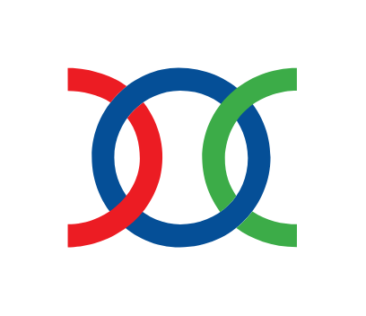

- [Linkedin](./linkedin.md)  

- [Livejournal](./livejournal.md)  

- [MailRu](./mail-ru.md)  
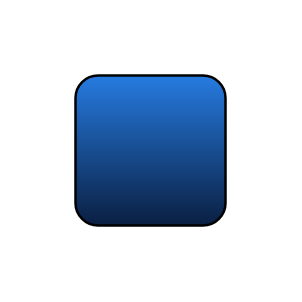

- [Mathoverflow](./mathoverflow.md)  

- [Meetup](./meetup.md)  

- [Meneame](./meneame.md)  

- [Messenger](./messenger.md)  

- [Messenger2](./messenger-2.md)  

- [Messenger3](./messenger-3.md)  

- [MindBodyGreen](./mind-body-green.md)  

- [Mongodb](./mongodb.md)  

- [Myspace](./myspace.md)  

- [N4g](./n4g.md)  
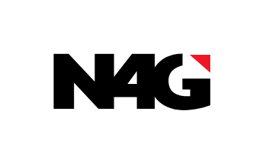

- [Netlog](./netlog.md)  

- [Netvibes](./netvibes.md)  

- [Netvouz](./netvouz.md)  

- [Networkedblogs](./networkedblogs.md)  

- [Newsvine](./newsvine.md)  

- [Odnoklassniki](./odnoklassniki.md)  

- [Oknotizie](./oknotizie.md)  

- [Onedrive](./onedrive.md)  

- [Oracle](./oracle.md)  

- [Paypal](./paypal.md)  

- [Phone](./phone.md)  

- [Phonefavs](./phonefavs.md)  

- [Pinterest](./pinterest.md)  

- [Plaxo](./plaxo.md)  

- [Playfire](./playfire.md)  

- [Plurk](./plurk.md)  

- [Pocket](./pocket.md)  

- [Protopage](./protopage.md)  

- [Readernaut](./readernaut.md)  

- [Reddit](./reddit.md)  

- [Rss](./rss.md)  

- [Scoopit](./scoopit.md)  

- [Scribd](./scribd.md)  

- [Segnalo](./segnalo.md)  

- [Sina](./sina.md)  

- [Sitejot](./sitejot.md)  

- [Skype](./skype.md)  

- [Skyrock](./skyrock.md)  

- [Slashdot](./slashdot.md)  

- [Sms](./sms.md)  

- [Socialvibe](./socialvibe.md)  

- [Society6](./society6.md)  

- [Sonico](./sonico.md)  

- [Soundcloud](./soundcloud.md)  

- [Sourceforge](./sourceforge.md)  

- [Sourceforge2](./sourceforge-2.md)  

- [Sourcetree](./sourcetree.md)  

- [SpringMe](./spring-me.md)  

- [Stackexchange](./stackexchange.md)  

- [Stackoverflow](./stackoverflow.md)  

- [Startaid](./startaid.md)  

- [Startlap](./startlap.md)  

- [Statuspage](./statuspage.md)  
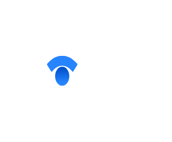

- [Steam](./steam.md)  

- [Stride](./stride.md)  

- [Stumbleupon](./stumbleupon.md)  

- [Stumpedia](./stumpedia.md)  

- [Translate](./translate.md)  

- [Trello](./trello.md)  

- [Tumblr](./tumblr.md)  

- [Tunein](./tunein.md)  

- [Twitter](./twitter.md)  

- [Two](./two.md)  
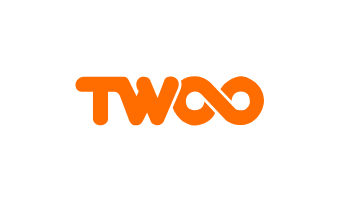

- [Typepad](./typepad.md)  

- [Viadeo](./viadeo.md)  

- [Viber](./viber.md)  

- [Viddler](./viddler.md)  

- [Vimeo](./vimeo.md)  

- [Virb](./virb.md)  

- [Vkontakte](./vkontakte.md)  

- [Wakoopa](./wakoopa.md)  
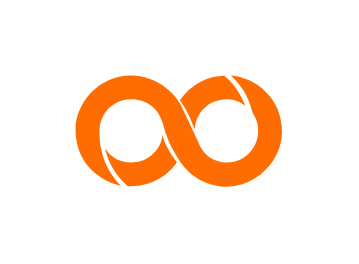

- [Weheartit](./weheartit.md)  

- [Whatsapp](./whatsapp.md)  

- [Wix](./wix.md)  

- [Wordpress](./wordpress.md)  

- [Wordpress2](./wordpress-2.md)  

- [Xanga](./xanga.md)  

- [Xerpi](./xerpi.md)  

- [Xing](./xing.md)  

- [Yahoo](./yahoo.md)  

- [Yahoo2](./yahoo-2.md)  

- [Yammer](./yammer.md)  

- [Yandex](./yandex.md)  

- [Yelp](./yelp.md)  

- [Yoolink](./yoolink.md)  

- [Youmob](./youmob.md)  

- [Youtube](./youtube.md)  

- [Youtube2](./youtube-2.md)  

