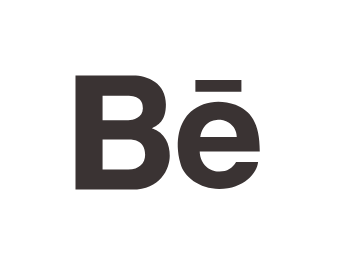

# Behance

## Definition

```js
{
  _style: {
    entity: 'dashed=0;outlineConnect=0;html=1;align=center;labelPosition=center;verticalLabelPosition=bottom;verticalAlign=top;shape=mxgraph.weblogos.behance;fillColor=#3A3333',
  },
  _width: 73.8,
  _height: 45.6,
}
```

## Usage

```js
import { Behance } from '@dinghy/standard-components-diagrams/webLogos'

<Behance/>
```

## Preview


