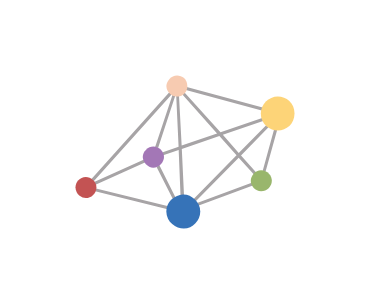

# Dzone

## Definition

```js
{
  _style: {
    entity: 'dashed=0;outlineConnect=0;html=1;align=center;labelPosition=center;verticalLabelPosition=bottom;verticalAlign=top;shape=mxgraph.weblogos.dzone',
  },
  _width: 87.60000000000001,
  _height: 61.2,
}
```

## Usage

```js
import { Dzone } from '@dinghy/standard-components-diagrams/webLogos'

<Dzone/>
```

## Preview


