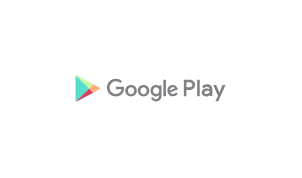

# Google Play Light

## Definition

```js
{
  _style: {
    entity: 'dashed=0;outlineConnect=0;html=1;align=center;labelPosition=center;verticalLabelPosition=bottom;verticalAlign=top;shape=mxgraph.weblogos.google_play_light;fillColor=#66E8F3;gradientColor=#1C7CBA',
  },
  _width: 60,
  _height: 10.4,
}
```

## Usage

```js
import { GooglePlayLight } from '@dinghy/standard-components-diagrams/webLogos'

<GooglePlayLight/>
```

## Preview


