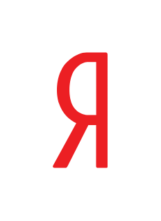

# Yandex

## Definition

```js
{
  _style: {
    entity: 'dashed=0;outlineConnect=0;html=1;align=center;labelPosition=center;verticalLabelPosition=bottom;verticalAlign=top;shape=mxgraph.weblogos.yandex',
  },
  _width: 31.8,
  _height: 66.4,
}
```

## Usage

```js
import { Yandex } from '@dinghy/standard-components-diagrams/webLogos'

<Yandex/>
```

## Preview


