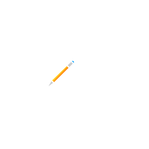

# Writing

## Definition

```js
{
  _style: {
    entity: 'image;aspect=fixed;perimeter=ellipsePerimeter;html=1;align=center;shadow=0;dashed=0;spacingTop=3;image=img/lib/active_directory/writing.svg;strokeColor=none;',
  },
  _original_width: 49,
  _original_height: 50,

}
```

## Usage

```js
import { Writing } from '@dinghy/standard-components-diagrams/activeDirectory'

<Writing/>
```

## Preview


