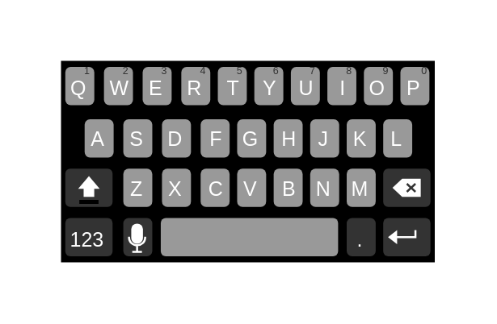
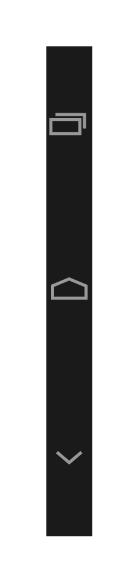
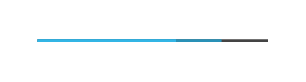

# Software Android Entities

- [ActionBar](./action-bar.md)  

- [ActionBarBright](./action-bar-bright.md)  

- [ActionBarLandscape](./action-bar-landscape.md)  

- [ActionBarLandscapeBright](./action-bar-landscape-bright.md)  

- [ButtonDisabledBright](./button-disabled-bright.md)  

- [ButtonDisabled](./button-disabled.md)  

- [ButtonFocusedBright](./button-focused-bright.md)  

- [ButtonFocusedDisabledBright](./button-focused-disabled-bright.md)  

- [ButtonFocusedDisabled](./button-focused-disabled.md)  

- [ButtonFocused](./button-focused.md)  

- [ButtonNormalBright](./button-normal-bright.md)  

- [ButtonNormal](./button-normal.md)  

- [ButtonPressedBright](./button-pressed-bright.md)  

- [ButtonPressed](./button-pressed.md)  

- [Checkboxes](./checkboxes.md)  

- [Color](./color.md)  

- [Color10](./color-10.md)  

- [Color2](./color-2.md)  

- [Color3](./color-3.md)  

- [Color4](./color-4.md)  

- [Color5](./color-5.md)  

- [Color6](./color-6.md)  

- [Color7](./color-7.md)  

- [Color8](./color-8.md)  

- [Color9](./color-9.md)  

- [ContactBadgeFocused](./contact-badge-focused.md)  

- [ContactBadgeNormal](./contact-badge-normal.md)  

- [ContactBadgePressed](./contact-badge-pressed.md)  

- [ContextualActionBar](./contextual-action-bar.md)  

- [ContextualActionBarBright](./contextual-action-bar-bright.md)  

- [ContextualActionBarLandscape](./contextual-action-bar-landscape.md)  

- [ContextualActionBarLandscapeBright](./contextual-action-bar-landscape-bright.md)  

- [ContextualSplitActionBar](./contextual-split-action-bar.md)  

- [ContextualSplitActionBarBright](./contextual-split-action-bar-bright.md)  

- [ContextualSplitActionBarLandscape](./contextual-split-action-bar-landscape.md)  

- [ContextualSplitActionBarLandscapeBright](./contextual-split-action-bar-landscape-bright.md)  

- [IndeterminateProgressBar](./indeterminate-progress-bar.md)  

- [IndeterminateSpinner](./indeterminate-spinner.md)  

- [Keyboard](./keyboard.md)  

- [MenuBar](./menu-bar.md)  

- [MenuBar2](./menu-bar-2.md)  

- [NavigationBar](./navigation-bar.md)  

- [NavigationBar2](./navigation-bar-2.md)  

- [NavigationBar3](./navigation-bar-3.md)  

- [NavigationBar4](./navigation-bar-4.md)  

- [NavigationBar5](./navigation-bar-5.md)  

- [NavigationBar6](./navigation-bar-6.md)  

- [NavigationBarLandscape](./navigation-bar-landscape.md)  

- [NavigationBarLandscape2](./navigation-bar-landscape-2.md)  

- [NavigationBarVertical](./navigation-bar-vertical.md)  

- [NavigationBarVertical2](./navigation-bar-vertical-2.md)  

- [Phone](./phone.md)  

- [PhoneLandscape](./phone-landscape.md)  

- [ProgressBar](./progress-bar.md)  

- [ProgressScrubberDisabled](./progress-scrubber-disabled.md)  

- [ProgressScrubberFocused](./progress-scrubber-focused.md)  

- [ProgressScrubberPressed](./progress-scrubber-pressed.md)  

- [QuickContact](./quick-contact.md)  

- [Quickscroll](./quickscroll.md)  

- [Quickscroll2](./quickscroll-2.md)  

- [ScrollableTab](./scrollable-tab.md)  

- [Scrollbars](./scrollbars.md)  

- [SectionHeaderActivatedBright](./section-header-activated-bright.md)  

- [SectionHeaderActivated](./section-header-activated.md)  

- [SectionHeaderDisabledFocusedBright](./section-header-disabled-focused-bright.md)  

- [SectionHeaderDisabledFocused](./section-header-disabled-focused.md)  

- [SectionHeaderDisabledBright](./section-header-disabled-bright.md)  

- [SectionHeaderDisabled](./section-header-disabled.md)  

- [SectionHeaderFocusedBright](./section-header-focused-bright.md)  

- [SectionHeaderFocused](./section-header-focused.md)  

- [SectionHeaderNormalBright](./section-header-normal-bright.md)  

- [SectionHeaderNormal](./section-header-normal.md)  

- [SectionHeaderPressedBright](./section-header-pressed-bright.md)  

- [SectionHeaderPressed](./section-header-pressed.md)  

- [SpinnerDisabledFocused](./spinner-disabled-focused.md)  

- [SpinnerDisabledFocusedBright](./spinner-disabled-focused-bright.md)  

- [SpinnerFocused](./spinner-focused.md)  

- [SpinnerNormal](./spinner-normal.md)  

- [SpinnerPressed](./spinner-pressed.md)  

- [SplitActionBar](./split-action-bar.md)  

- [SplitActionBarBright](./split-action-bar-bright.md)  

- [SplitActionBarLandscape](./split-action-bar-landscape.md)  

- [SplitActionBarLandscapeBright](./split-action-bar-landscape-bright.md)  

- [StatusBarPortrait](./status-bar-portrait.md)  

- [SwitchOff](./switch-off.md)  

- [SwitchOff2](./switch-off-2.md)  

- [SwitchOn](./switch-on.md)  

- [SwitchOn2](./switch-on-2.md)  

- [Tab](./tab.md)  

- [TabLandscape](./tab-landscape.md)  

- [TabBarBright](./tab-bar-bright.md)  

- [TextInsertionPoint](./text-insertion-point.md)  

- [TextSelectionHandles](./text-selection-handles.md)  

- [TextfieldActivated](./textfield-activated.md)  

- [TextfieldDisabled](./textfield-disabled.md)  

- [TextfieldNormal](./textfield-normal.md)  

- [TimePickerBright](./time-picker-bright.md)  

- [TimePickerDark](./time-picker-dark.md)  

