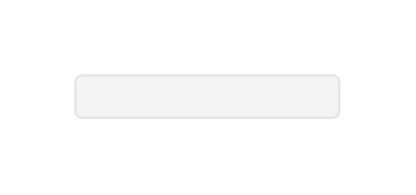

# Button (Focused, Disabled, Bright)

## Definition

```js
{
  _style: {
    entity: 'rounded=1;html=1;shadow=0;dashed=0;whiteSpace=wrap;fontSize=10;fillColor=#F4F4F4;align=center;strokeColor=#E6E6E6;fontColor=#CCCCCC;',
  },
  _width: 105.5,
  _height: 16.88,
}
```

## Usage

```js
import { ButtonFocusedDisabledBright } from '@dinghy/standard-components-diagrams/android'

<ButtonFocusedDisabledBright/>
```

## Preview


