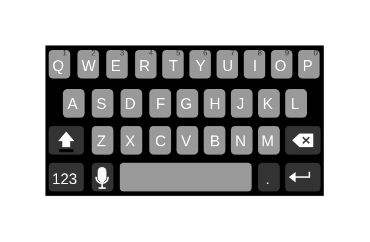

# Keyboard

## Definition

```js
{
  _style: {
    entity: 'verticalLabelPosition=bottom;verticalAlign=top;html=1;shadow=0;dashed=0;strokeWidth=1;shape=mxgraph.android.keyboard;sketch=0;',
  },
  _width: 185,
  _height: 100,
}
```

## Usage

```js
import { Keyboard } from '@dinghy/standard-components-diagrams/android'

<Keyboard/>
```

## Preview


