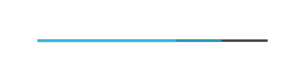

# Progress Bar

## Definition

```js
{
  _style: {
    entity: 'verticalLabelPosition=bottom;verticalAlign=top;html=1;shadow=0;dashed=0;strokeWidth=1;shape=mxgraph.android.progressBar;strokeColor=#33b5e5;dx1=0.8;dx2=0.6;strokeWidth=2;',
  },
  _width: 185,
  _height: 5,
}
```

## Usage

```js
import { ProgressBar } from '@dinghy/standard-components-diagrams/android'

<ProgressBar/>
```

## Preview


