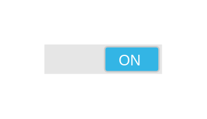

# Switch On 2

## Definition

```js
{
  _style: {
    entity: 'verticalLabelPosition=bottom;verticalAlign=top;html=1;shadow=0;dashed=0;strokeWidth=1;shape=mxgraph.android.switch_on;fillColor=#E6E6E6;sketch=0;',
  },
  _width: 80,
  _height: 20,
}
```

## Usage

```js
import { SwitchOn2 } from '@dinghy/standard-components-diagrams/android'

<SwitchOn2/>
```

## Preview


