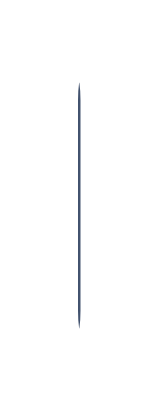

# Button (grouped, responsive)

## Definition

```js
{
  _style: {
    entity: 'strokeWidth=1;shadow=0;dashed=0;align=center;html=1;shape=mxgraph.mockup.rrect;rSize=10;fillColor=#42526E;strokeColor=#ffffff;strokeWidth=2;fontSize=12;fontColor=#ffffff;fontStyle=0;whiteSpace=wrap;',
  },
  _width: 3,
  _height: 104,
}
```

## Usage

```js
import { ButtonGroupedResponsive } from '@dinghy/standard-components-diagrams/atlassian'

<ButtonGroupedResponsive/>
```

## Preview


