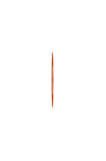

# Button (Primary) 3

## Definition

```js
{
  _style: {
    entity: 'html=1;shadow=0;dashed=0;shape=mxgraph.atlassian.close;fillColor=#BA3200;strokeColor=none;html=1;sketch=0;',
  },
  _width: 1,
  _height: 33,
}
```

## Usage

```js
import { ButtonPrimary3 } from '@dinghy/standard-components-diagrams/atlassian'

<ButtonPrimary3/>
```

## Preview


