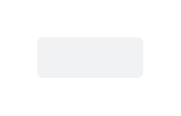

# Button (Standard) 2

## Definition

```js
{
  _style: {
    entity: 'rounded=1;fillColor=#F1F2F4;strokeColor=none;html=1;whiteSpace=wrap;fontColor=#596780;align=center;verticalAlign=middle;fontStyle=0;fontSize=12;sketch=0;',
  },
  _width: 86,
  _height: 33,
}
```

## Usage

```js
import { ButtonStandard2 } from '@dinghy/standard-components-diagrams/atlassian'

<ButtonStandard2/>
```

## Preview


