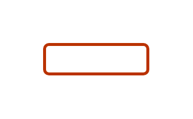

# Lozenge (problem, subtle)

## Definition

```js
{
  _style: {
    entity: 'dashed=0;html=1;rounded=1;strokeColor=#BA3200;fontSize=12;align=center;fontStyle=1;strokeWidth=2;fontColor=#BA3200',
  },
  _width: 70,
  _height: 20,
}
```

## Usage

```js
import { LozengeProblemSubtle } from '@dinghy/standard-components-diagrams/atlassian'

<LozengeProblemSubtle/>
```

## Preview


