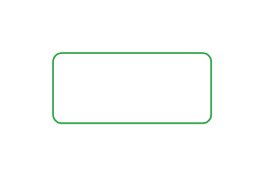

# Button, success 2

## Definition

```js
{
  _style: {
    entity: 'html=1;shadow=0;dashed=0;shape=mxgraph.bootstrap.rrect;rSize=5;strokeColor=#33A64C;strokeWidth=1;fillColor=none;fontColor=#33A64C;whiteSpace=wrap;align=center;verticalAlign=middle;spacingLeft=0;fontStyle=0;fontSize=16;spacing=5;',
  },
  _width: 90,
  _height: 40,
}
```

## Usage

```js
import { ButtonSuccess2 } from '@dinghy/standard-components-diagrams/bootstrap'

<ButtonSuccess2/>
```

## Preview


